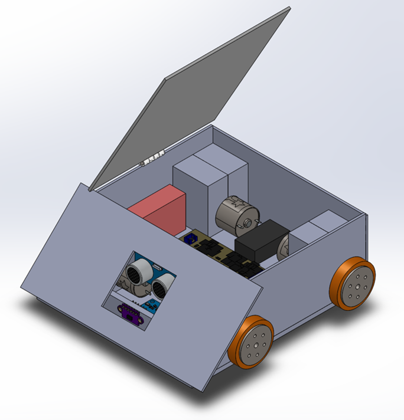

# Sumo_Bot

# Project Introduction
Sumo Bot is a sport that two robots try to push each other out of the circle arena. In order to push other robot out and keep themselves in the arena, normally there are a few line detect sensors at the bottom of the robot to sense the edge of the arena and couples of distance sensors on the robot to measure their opponents' location. 
In this project, we are going to build a sumo bot from scratch. This includes the PCB design, car shell CAD design, and firmware development for motors, sensors and other electronic components. 

# Table of Contents
* [Accomplishments](#accomplishments)
* [Bill of Materials](#bill-of-materials)
* [Mechanical Design](#mechanical-design)
* [PCB Design](#pcb-design)
* [High Level Wiring Diagram](#high-level-wiring-diagram)
* [System Structure](#system-structure)
* [WebUI](#webui)
* [Mobile App](#mobile-app)
* [Demonstration](#demonstration)

# Accomplishments
* Built a robot with 4 DC motors, 2 light reflect sensors, a laser ToF sensor, an IMU sensor, and a 3D printed shell
* Designed a PCB board containing voltage regulator, fuse, MCU chip, motor drivers, and voltage monitoring circuit
* Developed mannul mode and auto mode for 

# Bill of Materials

| Components | Part # | Quantity |
| :-----------:  | :-----------: |:-----------: |
| Water Temparature Sensor| DS18B20 | 1 |
| Water Quality Sensor |TDS Meter V1.0|1|
| Water Lavel Sensor | HW-038 |1|
| Soil Moisture Sensor| YL-69 |1|
|Light Intensity Sensor|Photoresistance|1|
| Inertial measurement unit | MPU6050 |1|
| Water Pump (DC 3v ~ 5V) |---|2|
| Relay (DC 5V) | --- |3|
| UV Light (DC 5V) | --- |1|
| MCU | ESP32 |1|
| MCU | ESP32_CAM |1|

# Mechanical Design
The full CAD model for the assembly of the sumo bot can be found in the [CAD folder](https://github.com/ElvisTang123/Sumo_Bot/tree/main/CAD%20Files) under our GitHub Repository.
<!-- Click [here](Media/Sumo_Bot_CAD_1.png) to see more -->
|  | |
| ---------------- | --------------- |

# PCB Design

# High Level Wiring Diagram

  

# Demonstration

