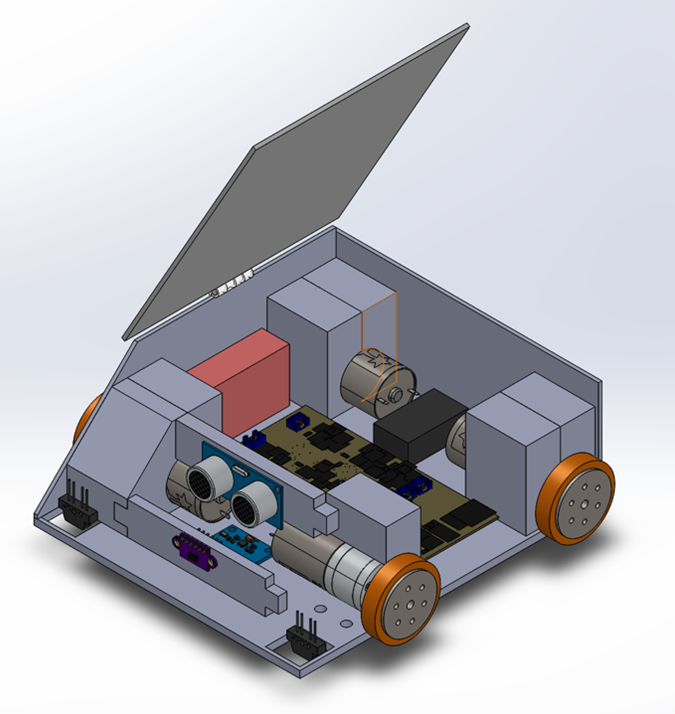
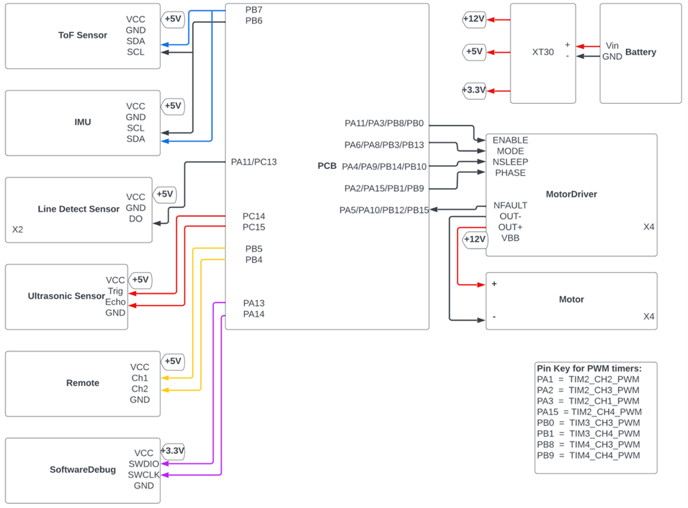

  

  <h1>Sumo_Bot - Annoying Orange</h1>

# Project Introduction
Sumo Bot is a sport that two robots try to push each other out of the circle arena. In order to push other robot out and keep themselves in the arena, normally there are a few line detect sensors at the bottom of the robot to sense the edge of the arena and couples of distance sensors on the robot to measure their opponents' location. 
In this project, we are going to build a sumo bot from scratch. This includes the PCB design, car shell CAD design, and firmware development for motors, sensors and other electronic components. 

# Table of Contents
* [Accomplishments](#accomplishments)
* [Bill of Materials](#bill-of-materials)
* [Mechanical Design](#mechanical-design)
* [PCB Design](#pcb-design)
* [High Level Wiring Diagram](#high-level-wiring-diagram)
* [Demonstration](#demonstration)

# Accomplishments
* Built a robot with 4 DC motors, 2 light reflect sensors, a laser ToF sensor, an IMU sensor, and a 3D printed shell
* Designed a PCB board containing voltage regulator, fuse, MCU chip, motor drivers, and voltage monitoring circuit
* Developed mannul mode (control the robot with remote control) and auto mode (robot's action is based on sensors' data feedback) for sumo bot control
* Designed the auto mode algorithms according to the sensors' data feedback in C programming

# Bill of Materials

| Components | Part # | Quantity |
| :-----------:  | :-----------: |:-----------: |
| DC Motor | 25D HP 12V Metal Gearmotors| 4 |
| Motor Driver |DRV8800PWP|4|
| ToF Laser Sensor | VL53L0X |1|
| Ultrasonic Distance Sensor | HC-SR04 |1|
| Infrared Reflective Sensor | TCRT5000 |2|
| Inertial measurement unit | MPU6050 |1|
| Remote Control Receiver | DUMBORC X6F |1|
| Wheels | JS4311 Aluminum |3|
| PCB Board | --- |1|

# Mechanical Design
The full CAD model for the assembly of the sumo bot can be found in the [CAD folder](https://github.com/ElvisTang123/Sumo_Bot/tree/main/CAD%20Files)
|  | |
| ---------------- | --------------- |

# PCB Design
The schematic and layout of the PCB board can be found in the [PCB Design](https://github.com/ElvisTang123/Sumo_Bot/tree/main/PCB%20Design)

  

# High Level Wiring Diagram

  

# Demonstration

